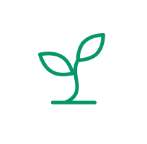
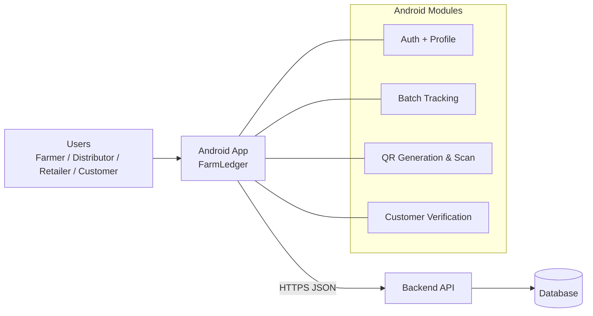

# FarmLedger

<div align="center">
  

  <h1>FarmLedger</h1>

  <p>End-to-end crop traceability for farmers, distributors, retailers, and buyers with QR-based batch verification.</p>

  <p>
    
    
    
    
    <a href="LICENSE"></a>
  </p>
</div>

---

**FarmLedger** is a multi‑role Android app for agricultural supply‑chain traceability. It records batch movement from farm to retailer, generates QR codes for verification, and shows a transparent, verifiable history to end customers.

---

## Overview

- Track crop batches from farmer to distributor to retailer with full handoff visibility.
- Generate and scan QR codes to verify batch authenticity and history.
- Provide role‑specific dashboards and workflows for each stakeholder.
- Show batch metadata, timestamps, locations, and status updates.
- Offer a customer verification flow for end‑buyer trust.

---

## Key Features

- **Role-based UX** for Farmer, Distributor, Retailer, and Customer.
- **Batch creation and tracking** with status, quantity, and metadata.
- **QR generation and scanning** for fast verification on each handoff.
- **Certificate view** for blockchain‑style proof display and sharing.
- **History timeline** for each batch with location and time updates.
- **Notifications and insights** for supply movement changes.

---

## Roles and Flows

- **Farmer**: create batches, assign distributors, generate QR codes, update locations.
- **Distributor**: accept batches, update transport milestones, pass to retailers.
- **Retailer**: confirm receipt, track inventory, verify incoming stock.
- **Customer**: scan QR to view product journey and certificate details.

---

## Architecture



---

## Tech Stack

- **Mobile**: Android (Kotlin), Gradle
- **UI**: Material Components, ViewBinding
- **Networking**: Retrofit + Gson
- **QR**: ZXing Embedded

---

## Project Structure

```text
.
|-- app/                          # Android client
|   |-- src/main/
|   |   |-- AndroidManifest.xml
|   |   |-- java/com/farmledger/app/
|   |   |-- res/
|   |-- build.gradle.kts
|-- gradle/
|-- gradlew
|-- gradlew.bat
|-- settings.gradle.kts
|-- README.md
```

---

## Configuration

API base URL is defined here:

- `app/src/main/java/com/farmledger/app/ApiConfig.kt`

Update `BASE_URL` to point to your backend server.

---

## Getting Started

### Prerequisites

- Android Studio (recent stable)
- JDK 17

### Build

```bash
./gradlew :app:assembleDebug
```

### Run

Open the project in Android Studio and run the `app` configuration.

---

## Security Notes

- Do not hardcode production secrets in the client.
- Use HTTPS for all API requests in production.
- Validate all QR payloads and batch IDs server‑side.

---

## License

MIT License. See [LICENSE](LICENSE).
